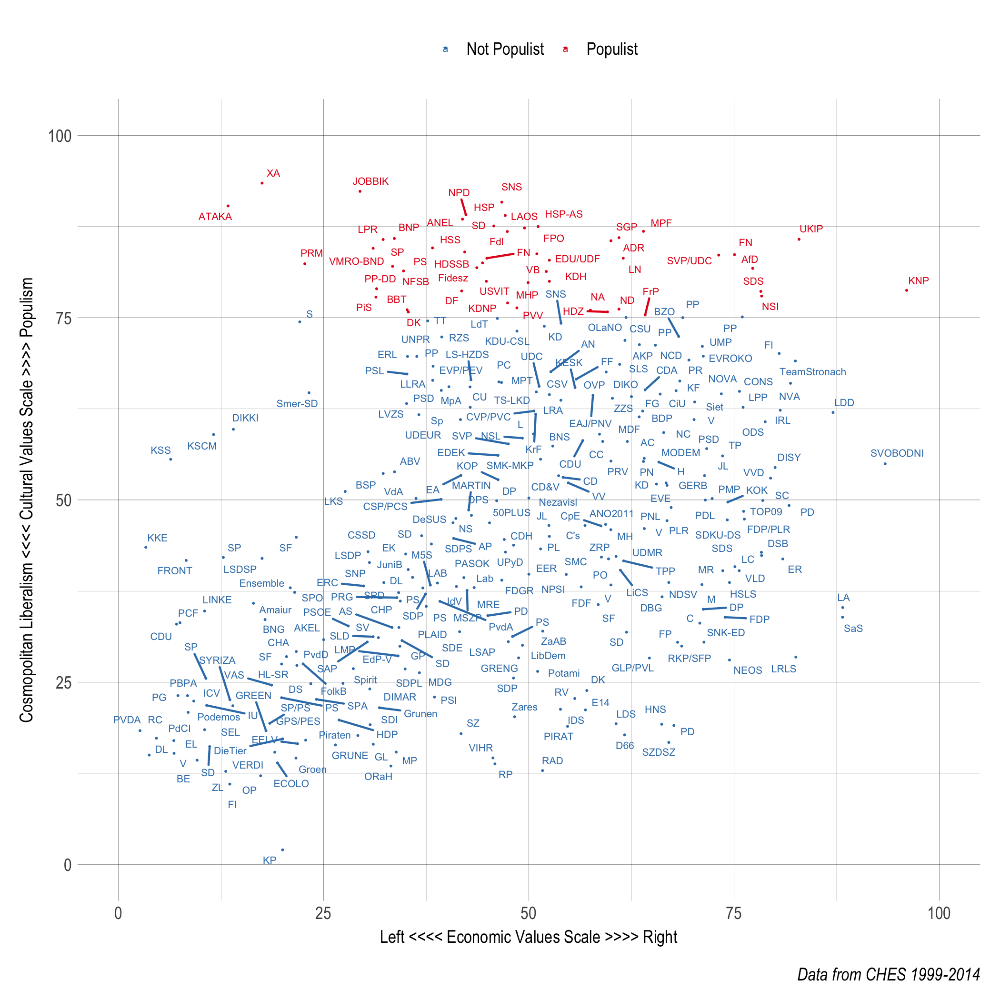
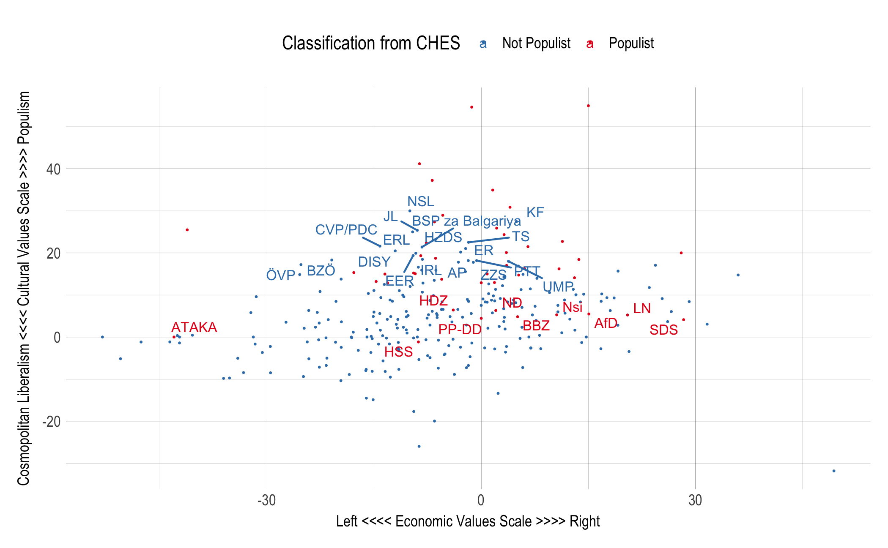
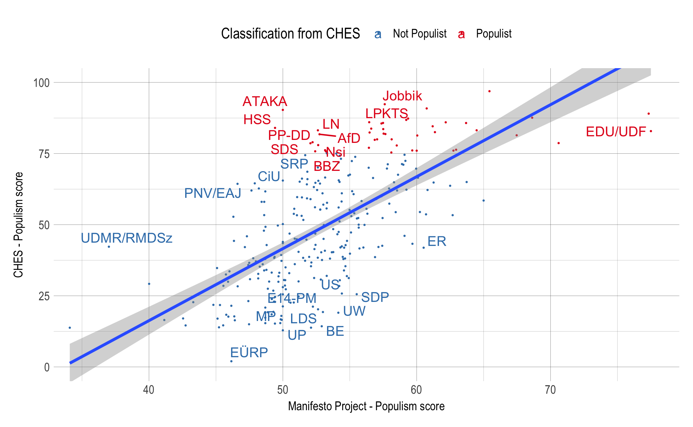
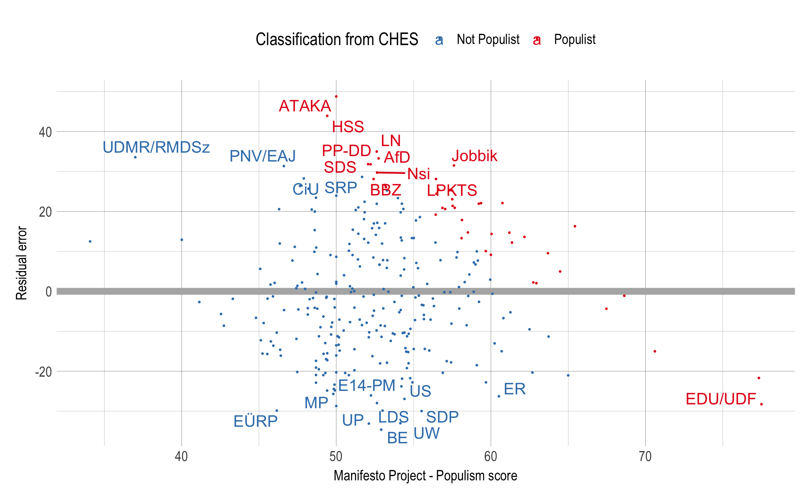

Party Graphs
================
Declan Molloy
08/04/2018

This chapter outlines different methods of identifying populist parties.

Manifesto project classifications

Compare the two methods:

Significant differences in how the two methods classify parties

Residuals:

Above 0 means a party's CHES populism score is higher (more populist) than expected given its score from the Manifesto Project

