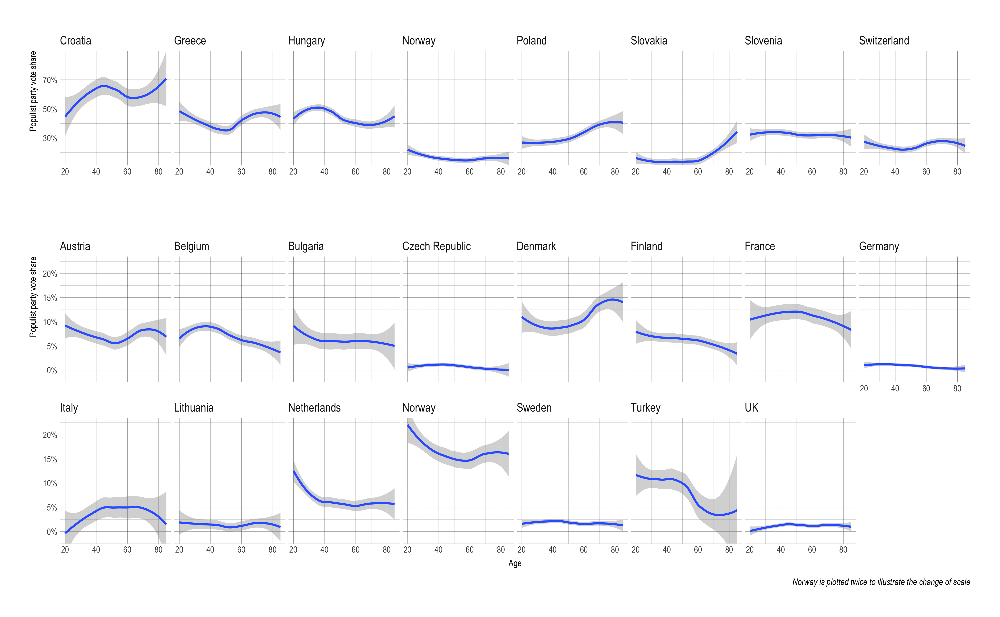

Populist Parties, who votes for them, and why
================
Declan Molloy

Identifying populist parties
============================

There are two main datasets that attempt to classify parties around the world on various metrics, the Chapel Hill Expert Survey (CHES) and the Manifesto Project (previously known as the Comparative Manifesto Project). Neither explicitly code for populism, and so the challenge is to figure out a way to use the variables they do measure to try and come up with a systematic way to classify a party as populist or not.

Chapel Hill Expert Survey
-------------------------

To begin with, we'll look at the CHES dataset, which has asked country experts to rate various parties on different metrics. Inglehart and Norris have found that 13 variables from CHES neatly correspond to two separate cleavages: four can be reduced to an economic cleavage and nine can be reduced to a cultural cleavage. The variables summed to create the populism factor have been chosen to closely reflect ideological leanings associated with right wing populism. The results for every party is plotted below on both economic and populist scales, with parties classified as populist coloured in red, corresponding to higher cultural cleavage scores.

Manifesto Project
-----------------

A second large scale source of data on parties is the Manifesto Project which, as the name suggests, examines the electoral manifestos and other related materials of parties, coding based on how often certain topics are mentioned. Again, parties are plotted on an economic and populist scale. Parties have also been coloured according to whether they were previously classified as populist in the CHES dataset. As parties take a much smaller range of values and are thus more tightly clustered using the Manifesto project variables, it was not possible to label all of them. In order to highlight the differences in outcomes between the CHES and Manifesto Project results, political parties have been labelled that were classed as populist by the CHES data but scored lowly on the populist scale using the Manifesto Project data, as well as parties that scored highly but were not classified as populist by CHES.

To further compare and contrast both datasets and methods, the Manifesto Project populist scores have been rescaled to a 0-100 scale, then each party plotted by their populist scores from the CHES data against the scores from the Manifesto data. Also included is a simple linear regression showing the relationship between the two scores, with some of the parties that have the highest absolute residuals from this linear regression labelled.

Finally, I've plotted the residuals themselves, with the same parties labelled. Parties above 0 means a party's CHES populism score is higher (more populist) than expected given its score from the Manifesto Project.

Which to use?
-------------

Looking at these comparisons, it becomes clear that the Manifesto Project populism score is worse at identifying populist radical right parties than the CHES score. The plot of its party classifications shows several widely accepted populist parties, including *Ataka* in Bulgaria, *AfD* in Germany and *Lega Nord* in Italy, with populist scores close to the mean of all parties. This difference is even more stark in when we look at the residuals, where we can see that the parties rated higher by CHES include other populist parties, such as *Jobbik* in Hungary and the *People's Party – Dan Diaconescu* in Romania. Parties that are rated as higher by the Manifesto Project metric include more left-leaning parties, such as the *Left Bloc* in Portugal and the *Green Party* in Sweden. Given this project is focused on radical right populist parties, I use the CHES data to classify populist parties. See the appendix for a full table of populist parties.

Who votes for them?
===================

Now that we have identified which parties fall under the banner of populist radical right parties, it is time to turn our eye to who is voting for them. In particular, we want to know if certain political generations or age groups are more likely to vote for populist radical right parties than other age groups. This leads to my main finding: **contrary to popular belief, young voters are actually more likely to vote for populist parties.** Given this counter-intuitive result, the underlying data is investigated in order to prove that this result was not driven by statistical outliers. The conclusion still stands in the face of this analysis; younger voters are indeed more likely to vote for populist parties.

To figure out which age groups and generations are voting for the populist parties identified in the last chapter, we need data about which party people have voted for, and how old they were when they did so. The European Social Survey is a survey that asks a variety of questions about attitudes and voting behaviour to respondents across Europe. It has been run biennially since 2002 with the most recent release of data from 2014, meaning there are 7 waves of data with 331,871 individual respondents. Such a large sample means that we can accurately trace the age profiles of populist party voters even though many of these parties receive quite small vote shares. Respondents were weighted using both post-stratification weighting, which attempts to correct for non-response bias by weighting respondents so that the overall sample matches the composition of the general public in demographics such as age-group, gender, education, and regional distribution, as well as by country weights, which adjusts for the fact that different countries in Europe have different populations, but the sample size in each country is approximately the same. From here, the voting data was recoded such that it matched the CHES dataset. Countries that were not in the CHES dataset as well as non-voters were discarded, leaving us with 171,341 respondents who both voted and lived in a country covered by CHES. Respondents were then grouped by age and year of birth, with the weighted percentage of people who voted for a populist party calculated for each age and birth year. Finally, a simple locally weighted regression (LOESS) curve was plotted to fit this data for each wave of the ESS, resulting in the finding that young people are more likely to vote for populist parties than older people, graphed below.

In all bar the first two ESS waves the youngest voters are the most likely to vote for populist parties. In all bar the first wave, there is also a drop off of varying intensity in the number of people voting for populist parties starting at around age 70. The graphs clearly demonstrate period effects, especially the notable rise of populist voting in the 21st century. The first ESS wave, conducted in 2001-2002, shows less than 5% of respondents at any age voted for a populist party. By contrast, in the most recent survey, wave 7, almost 15% of the youngest respondents voted for a populist party. Finally, the graphs also show generational effects. At the extreme ends of the age spectrum, it would seem that age is a better predictor of voting patterns, with the youngest and oldest portions of the voting curves lining up better in the age plot than in the year of birth plot. However, the year of birth plot reveals a small bump in the level of populist voting in four of the seven waves for those born in the 1950s, an effect that cannot be observed in the age plot.

Given the counter-intuitive result, it is worth taking a more granular look at the data. Perhaps this finding is driven by one particular country with an overwhelming youth vote for a populist party, an outlier that skews the overall finding. To check for outliers,I plot the populist vote by each of the countries that had a populist party, with all ESS waves combined into one curve in order to maximise sample size. Note that the top row shows countries with a higher populist vote, and thus has a different scale on the y-axis to the other two rows (Norway is plotted on both scales to illustrate the scale difference).

While there are significant differences in trends between the countries, it is also clear that young people voting for populist parties is not isolated to one country. France, Norway, Belgium, Netherlands, Bulgaria, Finland, Germany and Turkey all show a clear trend that younger people are more likely to vote for populist parties. Clearly, the data is not uniform, and there are countries that buck the overall trend. As such, we can conclude that the data is somewhat country specific. Nevertheless, as there is nothing particularly obvious connecting the countries to do share the trend, and because respondents have been weighted to take into account country population, we can conclude that the overall data is valid; this result is not driven by a sole outlying country that has a huge young populist vote. The trend shows up in multiple unrelated countries as well as the overall plot. As such, young voters across Europe *are* more likely to vote for populist parties than older voters.

What drives populist voting?
============================

Given the surprising finding that populist radical right parties are more likely to be supported by young people, we can now turn to the next question: what is driving this support? Broadly, there are two main schools of thought to answer this question, one emphasising economic insecurity and the other pointing to cultural grievances. Unfortunately, neither theory predicts that young cohorts will vote for populist radical right parties at the highest rate. The cultural grievance hypothesis explicitly predicts that young voters ought to be the least likely to vote for radical right populist parties. It is harder to judge the economic insecurity thesis because it does not specify which cohorts are the most economically insecure, but in its most usual enunciation it argues that it is the 'losers of globalisation' who are susceptible to populist voting; older workers that have been laid-off as their jobs are shipped offshore. As such, this theory also fails to predict that young people are more likely to be populist voters. Nevertheless, both theories are examined in depth in order to find out exactly where they went wrong. I conclude that failing to explicitly treat age as a variable is the downfall of these theories. Finally, I examine what might cause age itself to cause young people to vote for populist radical right parties. Study after study shows that voting is a habit, and the data supports this with young voters having a much lower turnout than any other age group. I therefore conclude that only the most motivated and therefore most extreme young voters actually bother to vote, which naturally results in radical parties of both sides receiving a higher share of the vote than they do with other age groups.

Cultural Backlash
-----------------

Perhaps the most dominant thesis for what drives populist radical right voting is that of cultural grievances, which holds that populist voting is mainly driven by a cultural backlash against the rise of progressive values in society. This thesis was first proposed by Inglehart, who advanced the notion of ‘the silent revolution,’ whereby postmaterial values such as inclusion, environmental protection and equality have all gained greater prominence in recent times. He argues that this prompted a backlash among older generations, who see the erosion of traditional values as detrimental to society and who therefore vote for populist candidates that promise to a return to a society that respects these traditional values. The problem for this theory is that younger people, as we saw earlier, are more likely to vote for populist radical right parties than older people. Given such a spectacularly erroneous prediction, it is tempting to entirely dismiss this theory, but this would be a mistake. Instead, ESS data will again be used in an attempt to figure out exactly where the cultural backlash thesis has gone astray.

The most canonical examples of post-material values were plotted for all respondents as well as for only those who voted for populist parties. Four variables were chosen to reflect how the respondents felt about the environment, LGBTQI rights, and gender equality. Each question was rescaled onto a 0-100 scale, with 100 representing the most liberal option in every case. The results are plotted below.

The results are largely consistent with the part of the cultural backlash thesis stipulating that each successive generation was likely to be more progressive with regard to post-material values, with the notable exception of the environmental variable. For each of the other three variables, there is a clear linear trend of each younger cohort being successively more likely to hold a liberal view than those older. While the results are somewhat mixed, it can be concluded that the cultural backlash thesis is broadly correct so far; younger voters are more liberal when it comes to post-material values, and populist voters are less liberal than the overall population.

A variant on these post-material values of openness and tolerance is the idea that those voting for populist parties will have a certain psychological profile, specifically of being less open and more deferential to authority. To use the ESS to investigate these whether an authoritarian personality can help explain why young people are voting for populist radical right parties, we build an authoritarian index for each voter using variables that aim to measure how deferential someone is to authority, specifically the importance of living in safe surrounds, following rules, and behaving properly.

The curves for all voters and for populist voters both bear a striking resemblance to the series of curves we saw earlier when plotting post-material values. That is, the trend is linear for both groups, younger voters have less authoritarian personalities, and populist voters have more authoritarian personalities. So far so good for the post-material values thesis; as younger generations are more materially secure, they can afford to be more open and are less respectful of traditional norms than older generations.

Next, attitudes on immigration are looked at, perhaps the most widely linked variable to populist voting. The ESS asks respondents for their views on the effect immigration has on the economy, culture and overall country, with these variables combined and plotted below. Again, the result concurs with the existing literature. Younger people view immigration more positively than older people, with an approximately linear trend. Populist voters have a much dimmer view of immigrants than the overall public, with young populist voters holding a similar view of immigration to the oldest cohorts of the general public. Finally, the linear trend also holds among the subset of populist voters. Populist voters born earlier still view immigrants less favourably than those born more recently.

At this point, a rather confusing picture is presented. There is clearly something to the idea that younger generations are more liberal when it comes to post-material values. In most of the metrics that have been looked at so far, there is a clear linear trend whereby the youngest cohort has the most liberal view. Furthermore, populist voters are also on the whole less liberal than the overall population. It thus seems logical to draw the conclusion that therefore populist voting is driven in large part by older generations, who are the least liberal. However, this conclusion is wrong; young people are more likely to vote for populist parties than older people. What have we been missed? This is a complex question that I dive into more depth in my full thesis, but essentially this is a correlation vs causation problem. While populist voters are less liberal than the overall population for every year of birth, this is not what is driving the populist vote.

Economic insecurity
-------------------

The second major thesis aiming to explain the rise in populist voting is that of economic insecurity. This theory argues that it is the losers of globalisation who are increasingly drawn to populist causes. Again we use ESS data, this time to plot satisfaction in the economy, shown below. What results is a U-shaped curve, with older and younger people most satisfied in the economy, and those born in the late 1950s the least satisfied. Again, this could be a product of the lack of longitudinal data, with someone born in 1960 being 42 years old in the first ESS wave and 54 years old in the most recent, a fairly small and specific portion of their life. Perhaps there is something about these ages that leads to dissatisfaction in the economy. In any case, there is no evidence that young people are especially dissatisfied with the economy, as would be the case if it were driving populist voting. If anything, the opposite is found to be true. Interestingly, the youngest cohort of populist voters is only marginally more pessimistic about the economy than the overall view of the youngest cohort, so much so that the populist margin of error (represented by the error bars) ever so slightly crosses the overall voter curve. Not only are young people not more pessimistic than the other cohorts about the economy, but young populist voters aren't even that much more pessimistic than young people overall. As such, we can dismiss another theory: it is not dissatisfaction with the economy that is spurring younger voters to vote for populist radical right parties.

To recap, both of the main theories that purport to explain why people are likely to vote for populist parties fail to predict the voting behaviour of the youngest cohort. They all predict to various extents that older voters are more likely to be populist radical right voters. Given that this has already been found to be not the case, it makes sense that these theories would also be found deficient. Clearly, something is missing. Despite their collective failure to predict the populist vote age curve, most of these theories *do* tend to accurately portray the views of younger cohorts, describing them as less authoritarian, more liberal on social values, and less likely to be victims of globalisation, all of which is true. This further illustrates why it is so perplexing that younger cohorts are more likely to vote for populist parties. However, perhaps our focus has been misdirected: so far all of the theories looked at have advocated that some particular variable is what drives populist voting, and comparing the age distribution of that variable to the age distribution of the populist vote we have come up short each time. Perhaps age itself is the variable we are looking for.

Age as a variable
-----------------

Finally, we look at age itself as a variable. Perhaps younger people are always the most sceptical of the current political system because they have the least sway in democratic societies. As 18 year olds enter the electorate, they are dwarfed in number by older generations, and accordingly politicians pay little attention to them. Young people might therefore wish to express their discontent with the political status quo with a vote for parties that are overtly hostile toward it. Populist parties, with their emphasis on anti-elites, might appeal in this scenario. Below we plot three variables that might pick up on this discontent: trust in politicians, satisfaction with the national government and satisfaction with democracy. The last plot, trust in national governance, is a simple average of the other three. This plot shows some interesting results, but while the knowledge that older people are more generally more favourable to national political institutions than younger people is valuable, these results still don't shed any light on why younger voters are more likely to vote for populist parties. At worst, younger voters are no more dissatisfied with domestic political governance than those who are 50, and yet they still vote for populist parties at a higher rate.

Perhaps it is not domestic governance that young voters are riled up about, but instead global governing institutions, specifically the European Parliament and the United Nations. Respondents' feelings toward these two bodies are plotted in below, alongside the average of these variables, plotted as 'Trust in Global Governance.' For comparison, the average of the national governance variables from above is also plotted. Especially among the younger voters, global political institutions are viewed in high regard. Overall, I find no evidence that younger voters are voting for populist parties because they are dissatisfied with either global or domestic governance.

Finally, we turn to voting itself. There is a wealth of literature establishing that voting is habitual, both in terms of turnout and vote choice. Young people have not built the habit of voting and do so in far lower numbers than the rest of the population. The is demonstrated for each wave of ESS data below. Firstly, we can see that for the youngest age groups, the curves by age line up much more neatly than those by birth year. Secondly, we can see that after the most recent years of birth, where the respondents were young, the curves by birth year line up better than those by age, reflecting the fact that voting is a habit. Those who have experienced a few elections and voted in them are likely to continue to do so, while those who have experienced a few elections and not voted are also likely to continue to do so. Turnout therefore stabilises after the initial turbulence caused by age, and is thereafter driven more by cohort than age. Finally, a period effect in the form of the steady decline of turnout is also visible by focusing on a fixed age, for example 40 years old. Around 80% of 40 year olds voted in the first wave of the ESS, conducted in 2002, compared to around 70% of 40 year olds in the most recent wave.

With the knowledge that turnout is consistently lower for young voters, finally a more accurate picture of why young voters are more likely to vote for populist radical right parties begins to emerge. The low turnout of young voters presumably means only the most motivated are likely to show up to the ballot box. The fact that young voters are already psychologically more likely to vote for radical parties and that they have not participated in enough elections to have developed a habit for voting for a specific party all adds together to create an electorate of young people that are perfectly positioned to vote for populist radical right parties at rates higher than we would expect by simply looking at their ideological viewpoints. There is also evidence that populist radical right parties such as *AfD* in Germany use social media more effectively than their mainstream rivals, allowing them to bypass traditional media gatekeepers and communicate directly with their followers. This is likely to further bolster their youth turnout compared to mainstream parties. To conclude, it is only by treating age as a variable unto itself that the mystery of why young people are more likely to vote for populist radical right parties was unravelled.

Appendix
========

<table>
<caption>
Classification of Parties
</caption>
<thead>
<tr>
<th style="text-align:left;">
Country
</th>
<th style="text-align:right;">
CHES Wave
</th>
<th style="text-align:left;">
Party Abbreviation
</th>
<th style="text-align:left;">
Party Name in English
</th>
<th style="text-align:right;">
Election Year
</th>
<th style="text-align:right;">
Vote Share
</th>
<th style="text-align:right;">
Economic Scale
</th>
<th style="text-align:right;">
Populism Scale
</th>
</tr>
</thead>
<tbody>
<tr>
<td style="text-align:left;">
Austria
</td>
<td style="text-align:right;">
2014
</td>
<td style="text-align:left;">
FPO
</td>
<td style="text-align:left;">
Freedom Party of Austria
</td>
<td style="text-align:right;">
2013
</td>
<td style="text-align:right;">
20.50
</td>
<td style="text-align:right;">
50.97
</td>
<td style="text-align:right;">
83.75
</td>
</tr>
<tr>
<td style="text-align:left;">
Belgium
</td>
<td style="text-align:right;">
2014
</td>
<td style="text-align:left;">
VB
</td>
<td style="text-align:left;">
Flemish Block
</td>
<td style="text-align:right;">
2014
</td>
<td style="text-align:right;">
3.70
</td>
<td style="text-align:right;">
52.12
</td>
<td style="text-align:right;">
81.33
</td>
</tr>
<tr>
<td style="text-align:left;">
Belgium
</td>
<td style="text-align:right;">
2010
</td>
<td style="text-align:left;">
FN
</td>
<td style="text-align:left;">
National Front
</td>
<td style="text-align:right;">
2010
</td>
<td style="text-align:right;">
0.51
</td>
<td style="text-align:right;">
75.06
</td>
<td style="text-align:right;">
83.65
</td>
</tr>
<tr>
<td style="text-align:left;">
Bulgaria
</td>
<td style="text-align:right;">
2014
</td>
<td style="text-align:left;">
VMRO-BND
</td>
<td style="text-align:left;">
Bulgarian National Movement
</td>
<td style="text-align:right;">
2014
</td>
<td style="text-align:right;">
3.10
</td>
<td style="text-align:right;">
31.03
</td>
<td style="text-align:right;">
84.52
</td>
</tr>
<tr>
<td style="text-align:left;">
Bulgaria
</td>
<td style="text-align:right;">
2014
</td>
<td style="text-align:left;">
ATAKA
</td>
<td style="text-align:left;">
Attack
</td>
<td style="text-align:right;">
2014
</td>
<td style="text-align:right;">
4.50
</td>
<td style="text-align:right;">
13.35
</td>
<td style="text-align:right;">
90.33
</td>
</tr>
<tr>
<td style="text-align:left;">
Bulgaria
</td>
<td style="text-align:right;">
2014
</td>
<td style="text-align:left;">
NFSB
</td>
<td style="text-align:left;">
National Front for the Salvation of Bulgaria
</td>
<td style="text-align:right;">
2014
</td>
<td style="text-align:right;">
4.20
</td>
<td style="text-align:right;">
34.73
</td>
<td style="text-align:right;">
81.41
</td>
</tr>
<tr>
<td style="text-align:left;">
Bulgaria
</td>
<td style="text-align:right;">
2014
</td>
<td style="text-align:left;">
BBT
</td>
<td style="text-align:left;">
Bulgaria without Censorship
</td>
<td style="text-align:right;">
2014
</td>
<td style="text-align:right;">
5.70
</td>
<td style="text-align:right;">
35.32
</td>
<td style="text-align:right;">
75.78
</td>
</tr>
<tr>
<td style="text-align:left;">
Croatia
</td>
<td style="text-align:right;">
2014
</td>
<td style="text-align:left;">
HDZ
</td>
<td style="text-align:left;">
Croatian Democratic Union
</td>
<td style="text-align:right;">
2011
</td>
<td style="text-align:right;">
21.90
</td>
<td style="text-align:right;">
59.58
</td>
<td style="text-align:right;">
75.79
</td>
</tr>
<tr>
<td style="text-align:left;">
Croatia
</td>
<td style="text-align:right;">
2014
</td>
<td style="text-align:left;">
HSS
</td>
<td style="text-align:left;">
Croatian Peasant Party
</td>
<td style="text-align:right;">
2011
</td>
<td style="text-align:right;">
0.60
</td>
<td style="text-align:right;">
42.19
</td>
<td style="text-align:right;">
84.01
</td>
</tr>
<tr>
<td style="text-align:left;">
Croatia
</td>
<td style="text-align:right;">
2014
</td>
<td style="text-align:left;">
HDSSB
</td>
<td style="text-align:left;">
Croatian Democratic Alliance of Slavonia and Baranja
</td>
<td style="text-align:right;">
2011
</td>
<td style="text-align:right;">
3.00
</td>
<td style="text-align:right;">
44.36
</td>
<td style="text-align:right;">
82.51
</td>
</tr>
<tr>
<td style="text-align:left;">
Croatia
</td>
<td style="text-align:right;">
2014
</td>
<td style="text-align:left;">
HSP
</td>
<td style="text-align:left;">
Croatian Party of Rights
</td>
<td style="text-align:right;">
2011
</td>
<td style="text-align:right;">
3.00
</td>
<td style="text-align:right;">
47.12
</td>
<td style="text-align:right;">
89.02
</td>
</tr>
<tr>
<td style="text-align:left;">
Croatia
</td>
<td style="text-align:right;">
2014
</td>
<td style="text-align:left;">
HSP-AS
</td>
<td style="text-align:left;">
Croatian Party of Rights – Dr. Ante Starcevic
</td>
<td style="text-align:right;">
2011
</td>
<td style="text-align:right;">
0.60
</td>
<td style="text-align:right;">
51.13
</td>
<td style="text-align:right;">
87.49
</td>
</tr>
<tr>
<td style="text-align:left;">
Czech Republic
</td>
<td style="text-align:right;">
2014
</td>
<td style="text-align:left;">
USVIT
</td>
<td style="text-align:left;">
Tomio Okamura's Dawn of Direct Democracy
</td>
<td style="text-align:right;">
2013
</td>
<td style="text-align:right;">
6.90
</td>
<td style="text-align:right;">
44.82
</td>
<td style="text-align:right;">
79.99
</td>
</tr>
<tr>
<td style="text-align:left;">
Denmark
</td>
<td style="text-align:right;">
2014
</td>
<td style="text-align:left;">
DF
</td>
<td style="text-align:left;">
Danish Peoples Party
</td>
<td style="text-align:right;">
2011
</td>
<td style="text-align:right;">
12.20
</td>
<td style="text-align:right;">
41.81
</td>
<td style="text-align:right;">
78.67
</td>
</tr>
<tr>
<td style="text-align:left;">
Finland
</td>
<td style="text-align:right;">
2014
</td>
<td style="text-align:left;">
PS
</td>
<td style="text-align:left;">
Finnish Party | True Finns
</td>
<td style="text-align:right;">
2011
</td>
<td style="text-align:right;">
19.10
</td>
<td style="text-align:right;">
38.26
</td>
<td style="text-align:right;">
84.57
</td>
</tr>
<tr>
<td style="text-align:left;">
France
</td>
<td style="text-align:right;">
2014
</td>
<td style="text-align:left;">
FN
</td>
<td style="text-align:left;">
National Front
</td>
<td style="text-align:right;">
2012
</td>
<td style="text-align:right;">
13.60
</td>
<td style="text-align:right;">
44.89
</td>
<td style="text-align:right;">
83.16
</td>
</tr>
<tr>
<td style="text-align:left;">
France
</td>
<td style="text-align:right;">
2014
</td>
<td style="text-align:left;">
MPF
</td>
<td style="text-align:left;">
Movement for France
</td>
<td style="text-align:right;">
2012
</td>
<td style="text-align:right;">
0.23
</td>
<td style="text-align:right;">
63.96
</td>
<td style="text-align:right;">
86.84
</td>
</tr>
<tr>
<td style="text-align:left;">
Germany
</td>
<td style="text-align:right;">
2014
</td>
<td style="text-align:left;">
NPD
</td>
<td style="text-align:left;">
German People's Union
</td>
<td style="text-align:right;">
2013
</td>
<td style="text-align:right;">
1.30
</td>
<td style="text-align:right;">
42.33
</td>
<td style="text-align:right;">
89.12
</td>
</tr>
<tr>
<td style="text-align:left;">
Germany
</td>
<td style="text-align:right;">
2014
</td>
<td style="text-align:left;">
AfD
</td>
<td style="text-align:left;">
Alternative for Germany
</td>
<td style="text-align:right;">
2013
</td>
<td style="text-align:right;">
4.70
</td>
<td style="text-align:right;">
77.27
</td>
<td style="text-align:right;">
81.77
</td>
</tr>
<tr>
<td style="text-align:left;">
Greece
</td>
<td style="text-align:right;">
2014
</td>
<td style="text-align:left;">
ND
</td>
<td style="text-align:left;">
New Democracy
</td>
<td style="text-align:right;">
2012
</td>
<td style="text-align:right;">
29.70
</td>
<td style="text-align:right;">
60.97
</td>
<td style="text-align:right;">
76.17
</td>
</tr>
<tr>
<td style="text-align:left;">
Greece
</td>
<td style="text-align:right;">
2014
</td>
<td style="text-align:left;">
LAOS
</td>
<td style="text-align:left;">
Popular Orthodox Rally
</td>
<td style="text-align:right;">
2012
</td>
<td style="text-align:right;">
1.60
</td>
<td style="text-align:right;">
49.46
</td>
<td style="text-align:right;">
87.30
</td>
</tr>
<tr>
<td style="text-align:left;">
Greece
</td>
<td style="text-align:right;">
2014
</td>
<td style="text-align:left;">
ANEL
</td>
<td style="text-align:left;">
Independent Greeks
</td>
<td style="text-align:right;">
2012
</td>
<td style="text-align:right;">
7.50
</td>
<td style="text-align:right;">
41.92
</td>
<td style="text-align:right;">
88.51
</td>
</tr>
<tr>
<td style="text-align:left;">
Greece
</td>
<td style="text-align:right;">
2014
</td>
<td style="text-align:left;">
XA
</td>
<td style="text-align:left;">
Golden Dawn
</td>
<td style="text-align:right;">
2012
</td>
<td style="text-align:right;">
6.90
</td>
<td style="text-align:right;">
17.50
</td>
<td style="text-align:right;">
93.46
</td>
</tr>
<tr>
<td style="text-align:left;">
Hungary
</td>
<td style="text-align:right;">
2014
</td>
<td style="text-align:left;">
Fidesz
</td>
<td style="text-align:left;">
Fidesz -- Hungarian Civic Party / Christian Democratic People's Party
</td>
<td style="text-align:right;">
2014
</td>
<td style="text-align:right;">
39.50
</td>
<td style="text-align:right;">
43.66
</td>
<td style="text-align:right;">
81.85
</td>
</tr>
<tr>
<td style="text-align:left;">
Hungary
</td>
<td style="text-align:right;">
2010
</td>
<td style="text-align:left;">
KDNP
</td>
<td style="text-align:left;">
Christian Democratic People's Party
</td>
<td style="text-align:right;">
2010
</td>
<td style="text-align:right;">
7.32
</td>
<td style="text-align:right;">
47.41
</td>
<td style="text-align:right;">
77.02
</td>
</tr>
<tr>
<td style="text-align:left;">
Hungary
</td>
<td style="text-align:right;">
2014
</td>
<td style="text-align:left;">
JOBBIK
</td>
<td style="text-align:left;">
Jobbik Movement for a Better Hungary
</td>
<td style="text-align:right;">
2014
</td>
<td style="text-align:right;">
20.20
</td>
<td style="text-align:right;">
29.43
</td>
<td style="text-align:right;">
92.33
</td>
</tr>
<tr>
<td style="text-align:left;">
Italy
</td>
<td style="text-align:right;">
2014
</td>
<td style="text-align:left;">
LN
</td>
<td style="text-align:left;">
North League
</td>
<td style="text-align:right;">
2013
</td>
<td style="text-align:right;">
4.10
</td>
<td style="text-align:right;">
61.50
</td>
<td style="text-align:right;">
83.16
</td>
</tr>
<tr>
<td style="text-align:left;">
Italy
</td>
<td style="text-align:right;">
2014
</td>
<td style="text-align:left;">
Fdl
</td>
<td style="text-align:left;">
Brothers of Italy - National Centre-right
</td>
<td style="text-align:right;">
2013
</td>
<td style="text-align:right;">
2.00
</td>
<td style="text-align:right;">
47.38
</td>
<td style="text-align:right;">
86.82
</td>
</tr>
<tr>
<td style="text-align:left;">
Latvia
</td>
<td style="text-align:right;">
2014
</td>
<td style="text-align:left;">
NA
</td>
<td style="text-align:left;">
Latvian National Independence Movement
</td>
<td style="text-align:right;">
2014
</td>
<td style="text-align:right;">
16.60
</td>
<td style="text-align:right;">
57.50
</td>
<td style="text-align:right;">
76.03
</td>
</tr>
<tr>
<td style="text-align:left;">
Lithuania
</td>
<td style="text-align:right;">
2014
</td>
<td style="text-align:left;">
DK
</td>
<td style="text-align:left;">
The Way of Courage
</td>
<td style="text-align:right;">
2012
</td>
<td style="text-align:right;">
8.00
</td>
<td style="text-align:right;">
35.17
</td>
<td style="text-align:right;">
76.08
</td>
</tr>
<tr>
<td style="text-align:left;">
Luxembourg
</td>
<td style="text-align:right;">
2014
</td>
<td style="text-align:left;">
ADR
</td>
<td style="text-align:left;">
Alternative Democatic Reform Party
</td>
<td style="text-align:right;">
2013
</td>
<td style="text-align:right;">
6.60
</td>
<td style="text-align:right;">
60.00
</td>
<td style="text-align:right;">
85.56
</td>
</tr>
<tr>
<td style="text-align:left;">
Netherlands
</td>
<td style="text-align:right;">
2014
</td>
<td style="text-align:left;">
SGP
</td>
<td style="text-align:left;">
Reformed Political Party
</td>
<td style="text-align:right;">
2012
</td>
<td style="text-align:right;">
2.10
</td>
<td style="text-align:right;">
60.98
</td>
<td style="text-align:right;">
85.97
</td>
</tr>
<tr>
<td style="text-align:left;">
Netherlands
</td>
<td style="text-align:right;">
2014
</td>
<td style="text-align:left;">
PVV
</td>
<td style="text-align:left;">
Party for Freedom
</td>
<td style="text-align:right;">
2012
</td>
<td style="text-align:right;">
10.10
</td>
<td style="text-align:right;">
48.54
</td>
<td style="text-align:right;">
76.34
</td>
</tr>
<tr>
<td style="text-align:left;">
Norway
</td>
<td style="text-align:right;">
2014
</td>
<td style="text-align:left;">
FrP
</td>
<td style="text-align:left;">
Progress Party
</td>
<td style="text-align:right;">
NA
</td>
<td style="text-align:right;">
NA
</td>
<td style="text-align:right;">
64.17
</td>
<td style="text-align:right;">
75.37
</td>
</tr>
<tr>
<td style="text-align:left;">
Poland
</td>
<td style="text-align:right;">
2014
</td>
<td style="text-align:left;">
PiS
</td>
<td style="text-align:left;">
Law and Justice
</td>
<td style="text-align:right;">
2011
</td>
<td style="text-align:right;">
29.90
</td>
<td style="text-align:right;">
31.37
</td>
<td style="text-align:right;">
77.83
</td>
</tr>
<tr>
<td style="text-align:left;">
Poland
</td>
<td style="text-align:right;">
2010
</td>
<td style="text-align:left;">
LPR
</td>
<td style="text-align:left;">
League of Polish Families
</td>
<td style="text-align:right;">
2007
</td>
<td style="text-align:right;">
1.30
</td>
<td style="text-align:right;">
32.25
</td>
<td style="text-align:right;">
85.72
</td>
</tr>
<tr>
<td style="text-align:left;">
Poland
</td>
<td style="text-align:right;">
2014
</td>
<td style="text-align:left;">
KNP
</td>
<td style="text-align:left;">
Congress of the New Right
</td>
<td style="text-align:right;">
2011
</td>
<td style="text-align:right;">
1.10
</td>
<td style="text-align:right;">
96.03
</td>
<td style="text-align:right;">
78.75
</td>
</tr>
<tr>
<td style="text-align:left;">
Poland
</td>
<td style="text-align:right;">
2014
</td>
<td style="text-align:left;">
SP
</td>
<td style="text-align:left;">
United Poland
</td>
<td style="text-align:right;">
2011
</td>
<td style="text-align:right;">
NA
</td>
<td style="text-align:right;">
33.40
</td>
<td style="text-align:right;">
82.04
</td>
</tr>
<tr>
<td style="text-align:left;">
Romania
</td>
<td style="text-align:right;">
2010
</td>
<td style="text-align:left;">
PRM
</td>
<td style="text-align:left;">
Greater Romania Party
</td>
<td style="text-align:right;">
2008
</td>
<td style="text-align:right;">
3.20
</td>
<td style="text-align:right;">
22.70
</td>
<td style="text-align:right;">
82.39
</td>
</tr>
<tr>
<td style="text-align:left;">
Romania
</td>
<td style="text-align:right;">
2014
</td>
<td style="text-align:left;">
PP-DD
</td>
<td style="text-align:left;">
People's Party - Dan Dianconescu
</td>
<td style="text-align:right;">
2012
</td>
<td style="text-align:right;">
14.00
</td>
<td style="text-align:right;">
31.46
</td>
<td style="text-align:right;">
78.97
</td>
</tr>
<tr>
<td style="text-align:left;">
Slovakia
</td>
<td style="text-align:right;">
2014
</td>
<td style="text-align:left;">
KDH
</td>
<td style="text-align:left;">
Christian Democratic Movement
</td>
<td style="text-align:right;">
2012
</td>
<td style="text-align:right;">
8.80
</td>
<td style="text-align:right;">
52.50
</td>
<td style="text-align:right;">
79.98
</td>
</tr>
<tr>
<td style="text-align:left;">
Slovakia
</td>
<td style="text-align:right;">
2014
</td>
<td style="text-align:left;">
SNS
</td>
<td style="text-align:left;">
Slovak National Party
</td>
<td style="text-align:right;">
2012
</td>
<td style="text-align:right;">
4.60
</td>
<td style="text-align:right;">
46.70
</td>
<td style="text-align:right;">
90.84
</td>
</tr>
<tr>
<td style="text-align:left;">
Slovenia
</td>
<td style="text-align:right;">
2014
</td>
<td style="text-align:left;">
SDS
</td>
<td style="text-align:left;">
Slovenian Democratic Party
</td>
<td style="text-align:right;">
2014
</td>
<td style="text-align:right;">
20.70
</td>
<td style="text-align:right;">
78.26
</td>
<td style="text-align:right;">
78.60
</td>
</tr>
<tr>
<td style="text-align:left;">
Slovenia
</td>
<td style="text-align:right;">
2014
</td>
<td style="text-align:left;">
NSI
</td>
<td style="text-align:left;">
New Slovenia -- Christian People's Party
</td>
<td style="text-align:right;">
2014
</td>
<td style="text-align:right;">
5.60
</td>
<td style="text-align:right;">
78.36
</td>
<td style="text-align:right;">
77.96
</td>
</tr>
<tr>
<td style="text-align:left;">
Sweden
</td>
<td style="text-align:right;">
2014
</td>
<td style="text-align:left;">
SD
</td>
<td style="text-align:left;">
Sweden Democrats
</td>
<td style="text-align:right;">
2014
</td>
<td style="text-align:right;">
12.90
</td>
<td style="text-align:right;">
45.74
</td>
<td style="text-align:right;">
87.58
</td>
</tr>
<tr>
<td style="text-align:left;">
Switzerland
</td>
<td style="text-align:right;">
2014
</td>
<td style="text-align:left;">
SVP/UDC
</td>
<td style="text-align:left;">
Swiss People's Party
</td>
<td style="text-align:right;">
NA
</td>
<td style="text-align:right;">
NA
</td>
<td style="text-align:right;">
73.12
</td>
<td style="text-align:right;">
83.58
</td>
</tr>
<tr>
<td style="text-align:left;">
Switzerland
</td>
<td style="text-align:right;">
2014
</td>
<td style="text-align:left;">
EDU/UDF
</td>
<td style="text-align:left;">
Federal Democratic Union of Switzerland
</td>
<td style="text-align:right;">
NA
</td>
<td style="text-align:right;">
NA
</td>
<td style="text-align:right;">
52.50
</td>
<td style="text-align:right;">
82.88
</td>
</tr>
<tr>
<td style="text-align:left;">
Turkey
</td>
<td style="text-align:right;">
2014
</td>
<td style="text-align:left;">
MHP
</td>
<td style="text-align:left;">
National Action Party
</td>
<td style="text-align:right;">
NA
</td>
<td style="text-align:right;">
NA
</td>
<td style="text-align:right;">
49.90
</td>
<td style="text-align:right;">
79.81
</td>
</tr>
<tr>
<td style="text-align:left;">
UK
</td>
<td style="text-align:right;">
2014
</td>
<td style="text-align:left;">
UKIP
</td>
<td style="text-align:left;">
United Kingdom Independence Party
</td>
<td style="text-align:right;">
2010
</td>
<td style="text-align:right;">
3.10
</td>
<td style="text-align:right;">
82.92
</td>
<td style="text-align:right;">
85.75
</td>
</tr>
<tr>
<td style="text-align:left;">
UK
</td>
<td style="text-align:right;">
2010
</td>
<td style="text-align:left;">
BNP
</td>
<td style="text-align:left;">
British National Party
</td>
<td style="text-align:right;">
2010
</td>
<td style="text-align:right;">
1.90
</td>
<td style="text-align:right;">
33.61
</td>
<td style="text-align:right;">
85.86
</td>
</tr>
</tbody>
</table>
